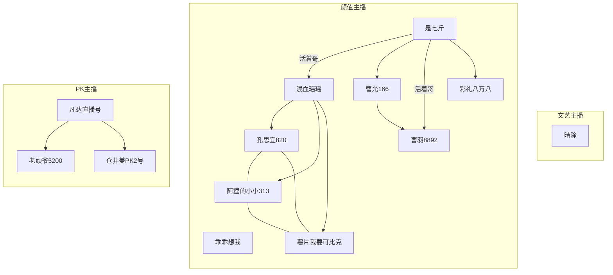

# 这是一篇真诚的交友帖

我想聊一聊感情，以某种最真实、最坦诚的方式。

## 说在前面的话

其实很长一段时间内，感情对于我来说是一个可有可无的东西，因为我高强度地忙着实习、工作与考研，或是漂泊在路上。

这种状态从我最后一次分手（2019/1/29，美赛结束）开始一直延续到东航空难（2022/3/21）那一天，我突发性地软组织挫伤，躺在北漂的床上独自一人无法动弹，人生中第一次有一种深深的无力感，一种强烈的渴望陪伴感。

其实我遭遇过的生死劫并不在少数，例如曾经摩托上高速摔滑后锁骨骨折还继续坚持一小时独自开到医院，曾经在羊湖山顶扎营零下过夜冻到全身发抖每小时醒一次然后重感冒一周，等等。但都没有像此次一般，那个感觉是如此强烈：倘若有一个人在，多好。

一周后，我的身体已经逐渐好转，在这期间我又不断地、仔细地体味与审视我的内心：我真地需要一个现实伴侣吗？我在多大程度上需要？

事实上，确实有一些很现实的好处，如果我们拥有一个伴侣的话，比如我们小区最多的是火锅店与麻辣烫，这些都对单身很不友好，事实也是如此，我还未曾进过一次这些店；取而代之的，我会去更远的披萨店或是黄焖鸡米饭店等。

除此之外，大概就是去电影院、去赏花、去喝酒等一些娱乐场所，可能有一个人陪伴会是更好的选择；以及，另一部分，大家众所周知的需求。

但其他的，似乎就没有了，对于一个平凡的伴侣，TA的附加意义好像仅此这些而已。

这么分析下来，我又重新回到了之前的状态：感情对于我来说是一个可有可无的东西。

我已经早早缺少了曾经那么迫切地想要占有一个人、照顾一个人以及陪伴一个人成长的冲动与欲望。

如果仅仅是基于上述理由，那便没有此文了。

## 直播间记录

