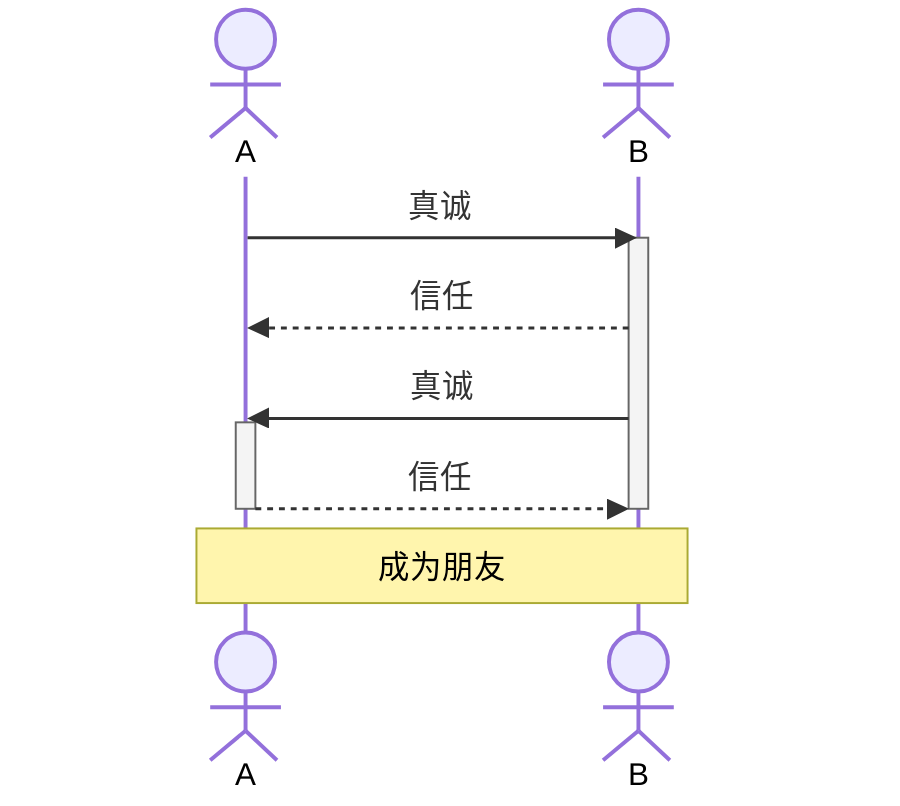

# 写一封真诚点的交友帖

必须承认，现在不是写一封交友帖的最佳时机。

所谓最佳时机，你们都知道的，那就是在某个人功成名就之时，再不济也是稳定有力之时，亦或就是顺风顺水之时。

很可惜的是，这些我都不具备。我现在既无钱（至少无大钱），也无名（至少无大名），虽稳定（倒也不见然）却不够有力（这是显然的），人生更是逆风逆水，一路狂奔，以至于任何一个用于描述追逐闪电狂奔的癫狂者形象的词不落在我头上我都会深深受伤的（laugh）。

更何况，大敌（omicron）当前，我怎敢没有一点觉悟竟于刀口舔血以谋私欲（格局可见一斑），我真是太不配此刻坐在皇城脚下的某张书桌前大放厥词了（简直厚颜无耻）。

可我始终觉得我是个“人”，一个有血有肉有情有义有理想有抱负有所追求有所坚持，最重要的，有所需求的人。

我首先是个人，其次是个守法的公民，再其次是一个响应时代号召、坚守道德良知、高举红色旗帜的知识分子。只是最为可惜的是，我已那么深刻地明了，我既不够红，也不够黑，我们一般定义这种人为：“时代的尘埃”（说好听点就是：“和光同尘”）。

因了这些，我斗胆拾起千斤之笔，破除心中万难，写一封交友信笺，渴盼临于您目前，只为搏君一笑。

考虑到我除了真诚，一无所有，故起名为《写一封真诚点的交友帖》，之所以加个“点”字，是因为能真，真多少，一点点。

---

## 什么是友

按照百度百科的解释：友是一个会意字，汉字隶定时经简化形成现在的写法。两人两手相交，表示友好，自古已然。现在的朋友见面“握手”，正可作“友”字的注脚。《说文》对“友”提出的志向相同这一标准，未必是甲骨文时代就有的观念，但却对后代文人的交友产生了重要影响。

我赞同“友”要有一个“志向相同”的标准，基于此才可以称之为“友”，倘若咱背道而驰，或者侧道而驰，不可称之为友，只可称之为对手或任一无相关关系的两个对象实体。

但有一种例外，例如殊路同归，这种应亦可称之为友。

由此可见，“友”不是一种生而具有的属性，一个人与我是否为友，不是第一次因缘巧合相识之后就能终生确认的，它应是一种状态，具有时效性，此时为友日后为敌也早已被世人屡见不鲜了，所谓“爱之深恨之切”大抵也是个中道理。

但却偏有人要信世间有“终生之友”的鬼话，他们把这类友冠了一个新词，叫做“灵魂伴侣”，英文叫“soulmate”，意思是在深处彼此相依，仿佛天造地设，只为对方存活。

似乎是有的罢。譬如西游记里女儿国国王与大唐高僧玄奘法师是否可划归为此类名目下呢？再譬如红楼梦里贾宝玉和林妹妹是否亦可添于此列呢：“今儿得罪了我事小，明儿什么宝姑娘来，什么贝姑娘来，都得罪了，这事岂不大了？”。想来，灵魂伴侣是具有一定的排他性，以及，确定性。

## 什么是交友

再按百度百科的解释：交友是人们为了摆脱自己单身的生活，而去结交认识他人的过程。交友的类型可以是女（男）朋友，也可以是普通朋友。指出主要是包括一方对另一方的信任，并把信任给予对方，允许对方与自己交往。

由此可见，“信任”是交友中一个很重要的概念。

在一段关系中，如何建立与加强信任，是一个颇为头疼的问题。

大多数人都会提到真诚，用真诚去换取真诚，从而建立信任，再通过一个个触发点加强这种信任，也许是一剂良方。

我想起一句话：没有一条路可以通往真诚，因为真诚本就是道路。

尽管从理工科角度这话似乎毫无道理，因为道路本就是相连的，但从感性角度，似乎确实如此。

真诚的核心是真，并且一直是真，譬如说一个人每天说一百句话，p表示分摊下来每句话为真的平均概率，则一年下来，我们可以说这个人是真诚的，当且仅当 p===1，这个要求是相当高的。

但值得吗？

这可能是一个看山的过程：开始觉得值得，后来觉得不值得，最终会觉得还是值得。

我希望我们都是觉得值得的那一类人。

  

## 为什么交友

一百年前，某二十八画生者在长沙报纸上登出一封征友启事：“愿嘤鸣以求友，敢步将伯之呼”。

一百年后，这份报纸变成了微信、微博、抖音、探探、soul、陌上花开……

交友变成了一件极其廉价、被动、随缘的事情。

在流行的MBTI性格测试官网 [Free Personality Test | 16Personalities](https://www.16personalities.com/free-personality-test) 上第一道题就是“你是否经常/有规律地结交新朋友”。

然而这道题并不是很好回答，因为选择更愿意结交新朋友可能意味着你现在正处于一个需要大量交朋友的新环境内，或者此时正觉得需要重塑一下目前的社交圈，而不能指向这个测试的真正意图：确定你是外向或内向。

一位朋友在我的mbti收集测试下回答：“entj，目标intj，不想再靠外部获得前进动力了”，让我不禁感慨，结交新朋友这个听起来好像再正常不过的一个操作似乎也有很大的必要去探讨一下它的合理性、方法论与影响。

时至今日，我们大概能窥见当年二十八画生交友的背景与动机，但我们对自己却往往尚不能那般清楚。

## 我为什么要交友

很高兴您能看到这个部分，因为如果您是认真阅读到这部分，这说明我们之间有着共同的磁场；而如果您是快速地、跳着看到这部分，则说明您有很好的快速获取有用信息的能力，亦是我中意之特质。

这篇文章，也许不会有什么波澜，但对我有着非同小可的意义。毕竟在我浅短的人生经历里，以往的交友大多都是基于学校、线下的，是先识面再识人，有很大的局限性。

而写这篇文章，确实需要十足的勇气，因为目前我正处在一个发展中、破慧的阶段。

我是九五年生，于南京乡下，幸天资尚可，一路升学至电子科技大学，修读软件工程，这是我人生的第一段，是不自觉、随大流的一段。

但大学一下让自己迷失了，我完全不知道要干什么，不知道现在的所学对将来有何作用，我无比深刻地记得有一门期末考的最后一道题是问“什么是大数据与云计算”，我毫无概念。

那年，我在成都主要就做了两件事，一是吃遍了各种火锅冒菜，一是学习滑板以期成为全村最靓的仔。

后来，我顺利地退学了，15年适逢

作为一个INFP，说实话，我并不是那么擅长交友的一个人，但我仍觉得交友，尤其是兼顾广度与深度的交友，依旧是一项必要。

从客观角度来说，我作为一个95年的南京人，只身在北京，投入工作，社交圈一下被局限，只得遵循路径依赖，这是催生我交友需求的理论条件。

从主观角度来说，

## 要交什么友

## 该如何交友
